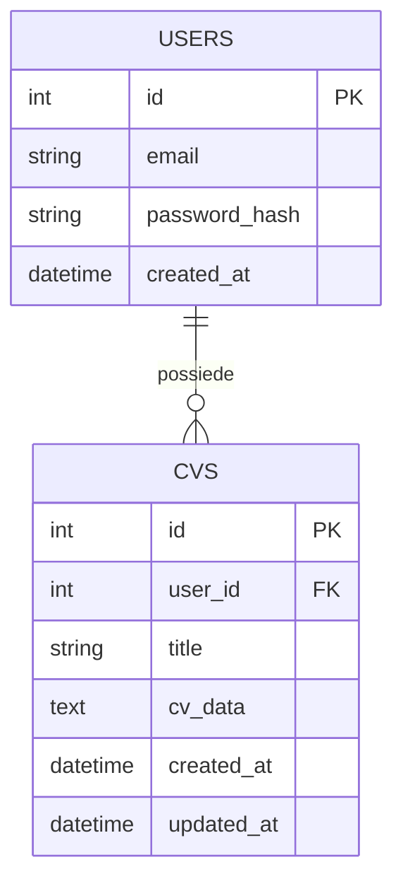
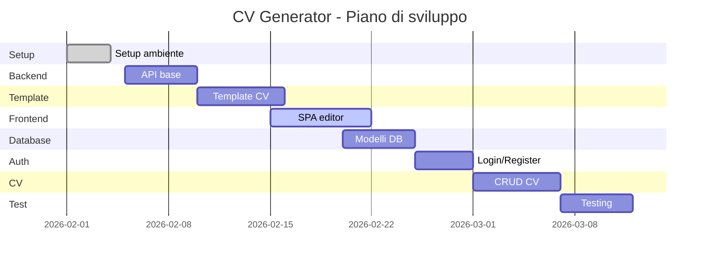
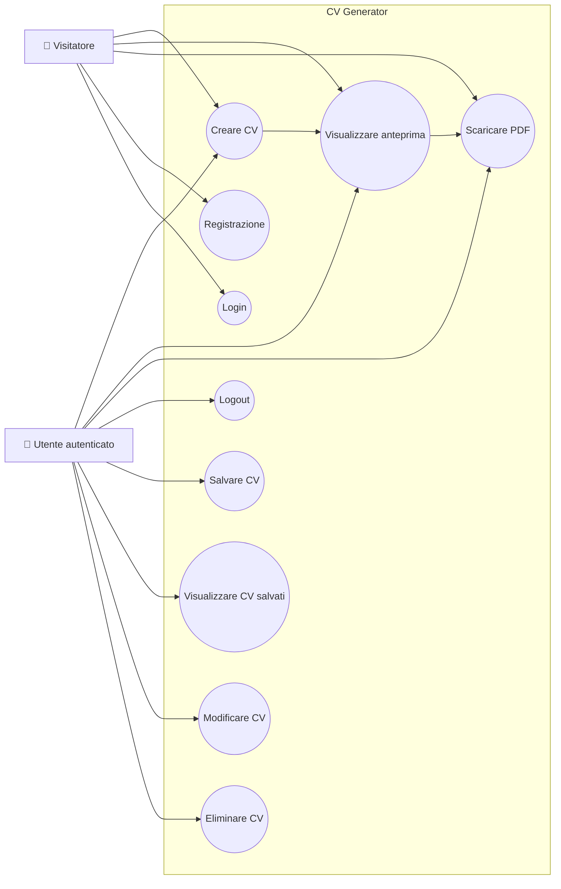

# 📄 CV Generator — Documento dei Requisiti (Versione Estesa)

**Modulo 03 — Sviluppo Web e Database**
Anno scolastico 2025/2026

---

# 1. Introduzione

## 1.1 Scopo del documento

Questo documento ha l’obiettivo di:

* descrivere in modo completo il sistema sviluppato;
* definire i requisiti funzionali e non funzionali;
* documentare architettura, API e modello dati;
* fornire una pianificazione dello sviluppo (roadmap + Gantt).

## 1.2 Contesto

Il progetto nasce nel contesto del modulo *Sviluppo Web e Database* e prevede la realizzazione di una web app completa con:

* backend in **Flask**
* database **SQLite + SQLAlchemy**
* autenticazione con **Flask-Login**
* generazione PDF con **ReportLab**
* frontend SPA (Single Page Application)

## 1.3 Tema del progetto

**CV Generator** è un’applicazione web che consente di:

* creare curriculum vitae professionali;
* visualizzarli in anteprima live;
* esportarli in PDF;
* salvarli (utenti autenticati).

---

# 2. Obiettivi

## 2.1 Obiettivi principali

* Creazione CV tramite form dinamico
* 4 template grafici selezionabili
* Anteprima live (debounce 250 ms)
* Download PDF
* Gestione sezioni dinamiche

## 2.2 Obiettivi avanzati (miglioramento)

* Persistenza dei CV
* Autenticazione utenti
* CRUD completo dei CV
* UX moderna e responsive
* Architettura modulare e scalabile

---

# 3. Stakeholder e Attori

## 3.1 Stakeholder

| Stakeholder   | Ruolo        | Interesse              |
| ------------- | ------------ | ---------------------- |
| Studente      | Sviluppatore | Realizzare il progetto |
| Docente       | Valutatore   | Verificare qualità     |
| Utente finale | Utilizzatore | Creare CV facilmente   |

## 3.2 Attori

* **Visitatore**

  * Usa il generatore senza salvataggio

* **Utente autenticato**

  * Salva e gestisce CV

* **Sistema Back-end**

  * Elabora dati, genera PDF, gestisce sessioni

---

# 4. Requisiti Funzionali

## 4.1 Generazione CV

* Inserimento foto profilo
* Inserimento dati personali
* Esperienze dinamiche
* Formazione dinamica
* Competenze multiple
* Selezione template
* Anteprima live
* Download PDF

## 4.2 Autenticazione

* Registrazione
* Login
* Logout
* Gestione sessione

## 4.3 Gestione CV

* Salvataggio CV
* Lista CV
* Modifica CV
* Eliminazione CV

---

# 5. API REST

| Metodo | Endpoint       | Autenticazione | Descrizione     |
| ------ | -------------- | -------------- | --------------- |
| GET    | /              | ❌              | SPA principale  |
| POST   | /preview       | ❌              | HTML preview    |
| POST   | /download      | ❌              | PDF             |
| POST   | /auth/register | ❌              | Registrazione   |
| POST   | /auth/login    | ❌              | Login           |
| POST   | /auth/logout   | ✅              | Logout          |
| GET    | /auth/me       | ✅              | Utente corrente |
| GET    | /cv            | ✅              | Lista CV        |
| POST   | /cv            | ✅              | Salva CV        |
| GET    | /cv/           | ✅              | Recupera CV     |
| PUT    | /cv/           | ✅              | Aggiorna CV     |
| DELETE | /cv/           | ✅              | Elimina CV      |

---

# 6. Requisiti Non Funzionali

* UI dark theme responsive
* Tempo risposta preview < 300 ms
* Python ≥ 3.10
* Password hash sicuro
* Architettura modulare
* Separazione template
* PDF A4 professionale
* Protezione API (401)

---

# 7. Architettura 

## 7.1 Pattern adottato

Architettura **MVC semplificata + REST API**

* **Model** → SQLAlchemy
* **View** → Jinja2 + frontend SPA
* **Controller** → Flask routes

## 7.2 Migliorie introdotte

* Separazione blueprint (`auth`, `cv`)
* Possibile futura migrazione a PostgreSQL
* Serializzazione JSON centralizzata
* Middleware per autenticazione

---

# 8. Struttura del Progetto

```
cv_generator/
├── app.py                  # Flask backend: routing e logica delle API
├── pdf_generator.py        # Generazione PDF con ReportLab (4 template)
├── models.py               # Modelli SQLAlchemy (User, CV)
├── auth.py                 # Blueprint autenticazione (login, register, logout)
├── requirements.txt        # Dipendenze Python
├── instance/
│   └── database.db         # Database SQLite
├── templates/
│   ├── index.html          # SPA dark-theme: editor + anteprima live
│   ├── login.html          # Pagina di login
│   ├── register.html       # Pagina di registrazione
│   ├── my_cvs.html         # Sezione "I miei curriculum"
│   ├── cv_classic.html     # Template Classico
│   ├── cv_modern.html      # Template Moderno
│   ├── cv_minimal.html     # Template Minimale
│   └── cv_creative.html    # Template Creativo
└── static/
    ├── css/
    └── js/
```

👉 Miglioria chiave: separazione **logica business / API**

# 8.1 Tecnologia	Utilizzo nel progetto

| Tecnologia            | Utilizzo nel progetto |
|---------------------|----------------------|
| Python 3 / Flask     | Backend HTTP: routing, rendering Jinja2, gestione richieste API REST |
| ReportLab            | Generazione lato server di documenti PDF in formato A4 |
| Jinja2               | Template engine per i 4 layout HTML del CV |
| JavaScript vanilla   | Anteprima live via fetch API, gestione dinamica del form |
| HTML / CSS custom    | Interfaccia editor dark-theme, animazioni, layout responsive |
| Flask-Login          | Gestione sessioni utente e protezione route |
| SQLAlchemy           | ORM per interazione con database SQLite |
| SQLite               | Database per persistenza utenti e CV |
| Werkzeug             | Hashing sicuro delle password |

---

# 9. Modello Dati (Diagramma ER)

## 9.1 Descrizione

Il sistema utilizza un database relazionale composto da due entità principali:

- **User** → rappresenta gli utenti registrati
- **CV** → rappresenta i curriculum salvati

Relazione:
- Un utente può avere **0/N CV**
- Ogni CV appartiene a **1 solo utente**

---
## 9.2 Diagramma ER (Mermaid)



---

# 10. Formato JSON

## CV

```json
{
  "name": "Mario Rossi",
  "title": "Developer",
  "template": "modern",
  "exp": [],
  "edu": [],
  "skills": []
}
```

## Salvataggio CV

```json
{
  "title": "CV azienda X",
  "cv_data": {}
}
```

---

# 11. Template

| ID       | Nome     |
| -------- | -------- |
| classic  | Classico |
| modern   | Moderno  |
| minimal  | Minimale |
| creative | Creativo |

---

# 12. Roadmap

| Milestone | Descrizione |
| --------- | ----------- |
| M1        | Setup       |
| M2        | Backend     |
| M3        | Template    |
| M4        | Frontend    |
| M5        | Database    |
| M6        | Auth        |
| M7        | CRUD CV     |
| M8        | Test        |

---

# 13. Diagrammi (Gantt e use-case)


## Diagramma dei Casi d'Uso


---

# 14. Estensioni Future

* Export DOCX
* OAuth (Google/GitHub)
* Condivisione CV via link
* Recupero password
* Editor drag & drop (upgrade UX)

---

# 15. Glossario


| Termine | Definizione      |
| ------------------- | ----------------------- |
|
| CV                  | Curriculum Vitae        |
| Template            | Layout grafico          |
| SPA                 | Single Page Application |
| Debounce            | Ritardo input           |
| ORM                 | Mappatura DB            |
| API REST            | Interfaccia HTTP        |
| JSON                | Formato dati            |

---

# 16. Miglioramenti suggeriti (Valore aggiunto)

* Introduzione di **JWT(Json web token) (in alternativa a sessioni)**
* Logging strutturato
* Validazione input lato backend (Marshmallow / Pydantic)
* Rate limiting API
* Caching preview (opzionale)

---

# 17. Conclusione

Il sistema rappresenta una web app completa che integra:

* frontend dinamico
* backend REST
* database relazionale
* generazione documenti

Il progetto è **scalabile, estendibile e pronto per evoluzioni future**.

---
